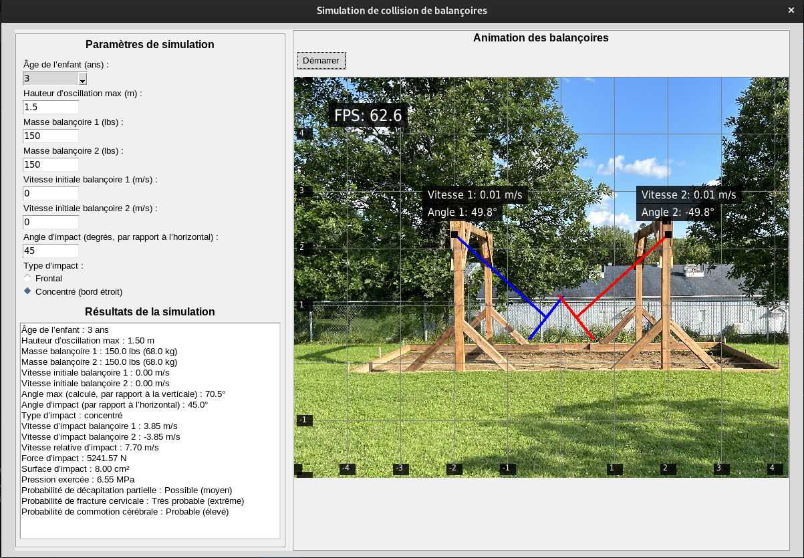
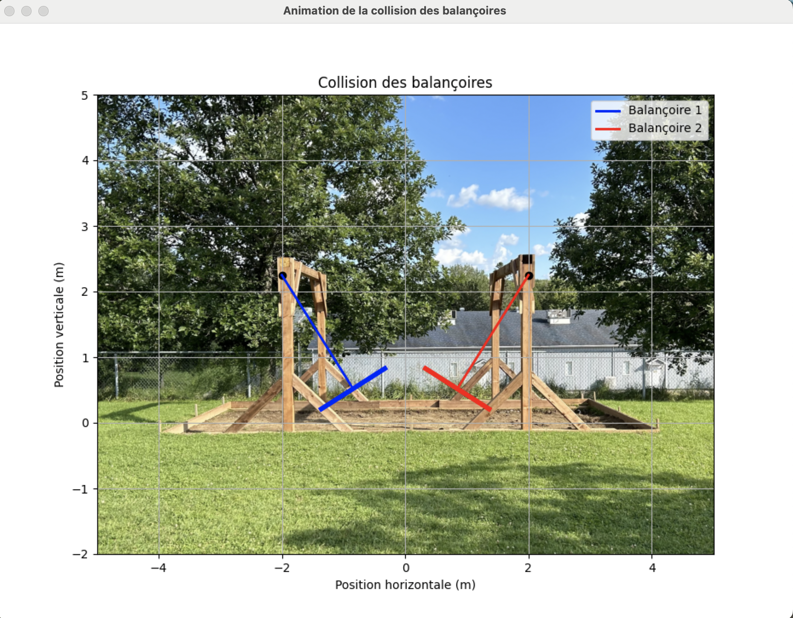

⚠️ **AVERTISSEMENT**

> Ce projet, **SwingCollisionSimulator**, s’inspire d’observations de situations réelles impliquant des balançoires. Il est conçu exclusivement à des **fins éducatives, de simulation et d’analyse**. L’analyse a été réalisée par un **inspecteur certifié canadien des aires de jeux (CPSI)** conformément à la norme **CSA Z614:20**.  
>  
> **IL EST STRICTEMENT INTERDIT DE REPRODUIRE CE PROJET DANS LA RÉALITÉ.** Toute tentative pourrait entraîner des **blessures graves ou des accidents**. Toute reproduction est **fortement déconseillée** et se fait aux **risques et périls de l’utilisateur**.

# SwingCollisionSimulator


## Description

**SwingCollisionSimulator** est une application Python qui simule la collision entre deux balançoires à plateforme, avec une analyse des risques de blessure pour un enfant (modélisé comme un bonhomme allumette). Le projet utilise `tkinter` pour une interface graphique interactive et `pygame` avec `OpenGL` pour une animation accélérée par GPU des balançoires oscillant face à face. L’utilisateur peut sélectionner l’âge de l’enfant, l’angle d’impact, et le type d’impact (frontal ou concentré) pour calculer la force, la pression exercée sur le cou, et la probabilité d’une décapitation partielle par écrasement. Un bonhomme allumette de 1 mètre est dessiné sur la balançoire pour représenter l’enfant.

### Caractéristiques principales

- Interface graphique interactive avec `tkinter` pour configurer les paramètres de la simulation.
- Animation GPU réaliste des balançoires avec `pygame` et `OpenGL`, incluant un bonhomme allumette assis sur une balançoire.
- Calculs physiques détaillés : vitesse, force d’impact, pression, et analyse des risques basée sur des données anthropométriques.
- Contrôle de l’animation via un bouton "Démarrer/Arrêter", avec l’animation arrêtée par défaut.
- Visualisation claire des balançoires oscillant face à face, avec détection de collision à l’angle spécifié.

## Prérequis

- **Python 3.11 ou ultérieur** : Testé avec Python 3.11.
- **Bibliothèques Python** (listées dans `requirements.txt`) :
  - `pygame` : Pour la fenêtre d’animation et le rendu OpenGL.
  - `PyOpenGL` : Pour les appels OpenGL accélérés par GPU.
  - `PyOpenGL_accelerate` : Améliore les performances de PyOpenGL (optionnel).
  - `numpy` : Pour les calculs numériques.
  - `tkinter` : Généralement inclus avec Python, mais peut nécessiter une installation sur Linux :
    ```bash
    sudo apt install python3-tk
    ```
- **Dépendances système (Linux)** : Nécessaires pour `pygame` :
  ```bash
  sudo apt install libsdl2-dev libsdl2-image-dev libsdl2-mixer-dev libsdl2-ttf-dev
  ```
- **Pilotes GPU** : GPU compatible avec OpenGL 2.1 ou supérieur. Vérifiez avec :
  ```bash
  sudo apt install mesa-utils
  glxinfo | grep "OpenGL version"
  ```

## Installation et exécution

   ```bash
   make all
   ```

## Installation

1. **Obtenir le Projet** :
   Si disponible dans un dépôt, clonez-le :
   ```bash
   git clone https://github.com/votre_nom/SwingCollisionSimulator.git
   cd SwingCollisionSimulator
   ```
2. **Configurer un Environnement Virtuel** :
   Pour éviter l’erreur `externally-managed-environment` :
   ```bash
   python3 -m venv venv
   source venv/bin/activate
   ```

3. **Installer les Dépendances** :
   ```bash
   pip install -r requirements.txt
   ```

## Utilisation

1. **Exécuter le Script** :
   ```bash
   python swing.py
   ```

2. **Configurer les Paramètres** :
   - **Âge de l’enfant** : Sélectionnez l’âge (1 à 5 ans) dans le menu déroulant.
   - **Hauteur d’oscillation max** : Entrez une valeur en mètres (max 2,25 m, par exemple, 0,5 m).
   - **Angle d’impact** : Entrez un angle entre 0° et l’angle max (par exemple, 30°).
   - **Type d’impact** : Choisissez entre `Frontal` ou `Concentré (bord étroit)`.

3. **Lancer l’Animation** :
   Cliquez sur **"Lancer l’animation"** pour ouvrir une fenêtre Pygame avec les balançoires et une fenêtre Tkinter avec un bouton "Démarrer". L’animation est arrêtée par défaut.
   - Cliquez sur "Démarrer" pour lancer l’animation.
   - Cliquez sur "Arrêter" pour la mettre en pause.
   - L’animation s’arrête à l’angle d’impact spécifié.

## Exemple de Résultats
- **Âge de l’enfant** : 3 ans
- **Hauteur d’oscillation max** : 1.50 m
- **Masse balançoire 1** : 130.0 lbs (59.0 kg)
- **Masse balançoire 2** : 130.0 lbs (59.0 kg)
- **Vitesse initiale balançoire 1** : 0.00 m/s
- **Vitesse initiale balançoire 2** : 0.00 m/s
- **Angle max (calculé, par rapport à la verticale)** : 70.5°
- **Angle d’impact (par rapport à l’horizontal)** : 45.0°
- **Type d’impact** : concentré
- **Vitesse d’impact balançoire 1** : 3.85 m/s
- **Vitesse d’impact balançoire 2** : -3.85 m/s
- **Vitesse relative d’impact** : 7.70 m/s
- **Force d’impact** : 4542.57 N
- **Surface d’impact** : 8.00 cm²
- **Pression exercée** : 5.68 MPa
- **Probabilité de décapitation partielle** : Possible (moyen)
- **Probabilité de fracture** : Possible (moyen)
- **Probabilité de commotion cérébrale** : Probable (élevé) 1.50 m

---

## Captures d’écran

### Interface principale



### Animation des balançoires



---
## Structure du Projet

- `swing.py` : Script principal contenant le code de la simulation et de l’animation GPU.
- `requirements.txt` : Liste des dépendances Python.

## Dépannage

- **ModuleNotFoundError: No module named 'pygame'** :
  - Vérifiez que l’environnement virtuel est actif :
    ```bash
    source venv/bin/activate
    ```
  - Réinstallez les dépendances :
    ```bash
    pip install -r requirements.txt
    ```

- **Erreur OpenGL** :
  - Vérifiez le support GPU :
    ```bash
    glxinfo | grep "OpenGL version"
    ```
  - Installez les pilotes si nécessaire :
    ```bash
    sudo apt install nvidia-driver
    ```

- **Erreur Tkinter** :
  - Installez `tkinter` :
    ```bash
    sudo apt install python3-tk
    ```

## Contribuer

1. Forkez le dépôt (si disponible).
2. Créez une branche :
   ```bash
   git checkout -b nouvelle-fonctionnalite
   ```
3. Commitez vos changements :
   ```bash
   git commit -m "Ajout de fonctionnalite"
   ```
4. Poussez et ouvrez une pull request.

## Licence

Ce projet est sous licence **MIT**.

## Auteurs

- Donavan Martin, Ing., Inspecteur certifié CPSI – Créateur initial – [Votre Profil GitHub](https://github.com/)
