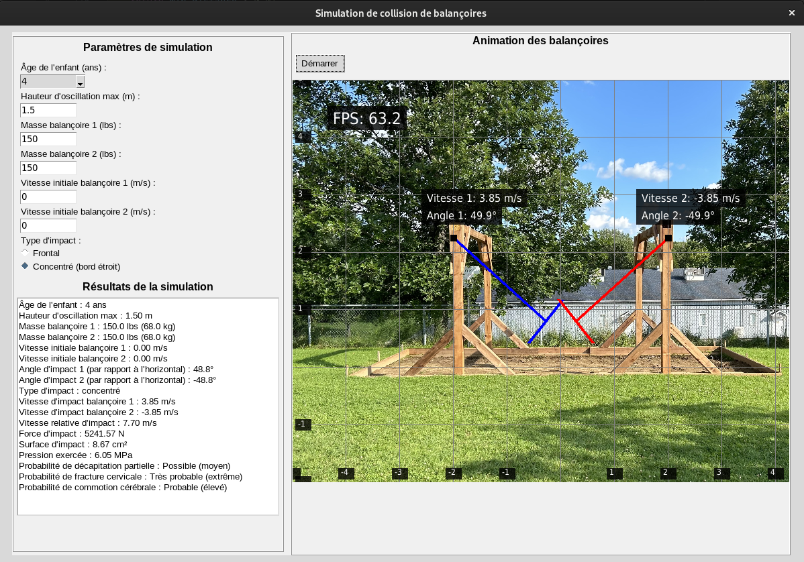

# SwingCollisionSimulator


## Description

**SwingCollisionSimulator** est une application Python qui modélise la collision entre deux balançoires à plateforme, évaluant les dangers de blessures pour un jeune utilisateur, tels que la fracture cervicale et la commotion cérébrale. Elle s’appuie sur tkinter pour offrir une interface graphique conviviale et interactive. L’animation, réalisée avec pygame et OpenGL pour un rendu fluide accéléré par GPU, représente les balançoires en mouvement opposé. L’utilisateur peut définir l’âge de l’enfant, le type d’impact (frontal ou concentré) et d’autres paramètres pour estimer la force d’impact, la pression sur le cou et les risques associés à ces blessures graves.


### Caractéristiques principales

- Interface graphique interactive avec `tkinter` pour configurer les paramètres de la simulation.
- Animation GPU réaliste des balançoires avec `pygame` et `OpenGL`.
- Calculs physiques détaillés : vitesse, force d’impact, pression, et analyse des risques basée sur des données anthropométriques.
- Contrôle de l’animation via un bouton "Démarrer/Arrêter"
- Visualisation claire des balançoires oscillant face à face, avec détection de collision à l’angle spécifié.


## Installation et exécution

   ```bash
   make all
   ```

## Utilisation

1. **Exécuter le Script** :
   ```bash
   make all
   ```

2. **Configurer les Paramètres** :
   - **Âge de l’enfant** : Sélectionnez l’âge (1 à 5 ans) dans le menu déroulant.
   - **Hauteur d’oscillation max** : Entrez une valeur en mètres (max 2,25 m, par exemple, 0,5 m).
   - **Angle d’impact** : Entrez un angle entre 0° et l’angle max (par exemple, 30°).
   - **Type d’impact** : Choisissez entre `Frontal` ou `Concentré (bord étroit)`.

3. **Lancer l’Animation** :
   Cliquez sur **"Lancer l’animation"** pour ouvrir une fenêtre Pygame avec les balançoires et une fenêtre Tkinter avec un bouton "Démarrer". L’animation est arrêtée par défaut.
   - Cliquez sur "Démarrer" pour lancer l’animation.
   - Cliquez sur "Arrêter" pour la mettre en pause.
   - L’animation s’arrête à l’angle d’impact spécifié.
---

## Captures d’écran

### Interface principale



## Structure du Projet

- `swing.py` : Script principal contenant le code de la simulation et de l’animation GPU.
- `requirements.txt` : Liste des dépendances Python.

## Contribuer

1. Forkez le dépôt (si disponible).
2. Créez une branche :
   ```bash
   git checkout -b nouvelle-fonctionnalite
   ```
3. Commitez vos changements :
   ```bash
   git commit -m "Ajout de fonctionnalite"
   ```
4. Poussez et ouvrez une pull request.

## Licence

Ce projet est sous licence **MIT**.

⚠️ **AVERTISSEMENT**

> Ce projet, s’inspire d’observations de situations réelles impliquant des balançoires. Il est conçu exclusivement à des **fins éducatives, de simulation et d’analyse**. L’analyse a été réalisée par un **inspecteur certifié canadien des aires de jeux (CPSI)** conformément à la norme **CSA Z614:20**.  
>  
> **IL EST STRICTEMENT INTERDIT DE REPRODUIRE CE PROJET DANS LA RÉALITÉ.** Toute tentative pourrait entraîner des **blessures graves ou des accidents**. Toute reproduction est **fortement déconseillée** et se fait aux **risques et périls de l’utilisateur**.

## Auteurs

- Donavan Martin, Ing., Inspecteur certifié CPSI – Créateur initial – [Votre Profil GitHub](https://github.com/)
